# Microsoft Defender for Endpoint Azure Connector for VMRay Advanced Malware Sandbox

**Latest Version:** beta - **Release Date:** 

## Overview

This project is an integration between Microsoft Defender for Endpoint and VMRay products: Analyzer, FinalVerdict and Totalinsight. 
The connector will collect alerts and related evidences, and query or submit these samples into VMRay Sandbox.
It accelerates the triage of alerts by adding comments to the alert in MS Defender Console with the analysis of the sample.
It also retrieves IOC values from VMRay and submits them into Microsoft Defender for Endpoint.

## Requirements
- Microsoft Defender for Endpoint.
- VMRay Analyzer, VMRay FinalVerdict, VMRay TotalInsight.
- Microsoft Azure.

## VMRay Configurations

- In VMRay Console, you must create a Connector API key.Create it by following the steps below:
  
  1. Create a user dedicated for this API key (to avoid that the API key is deleted if an employee leaves)
  2. Create a role that allows to "View shared submission, analysis and sample" and "Submit sample, manage own jobs, reanalyse old analyses and regenerate analysis reports".
  3. Assign this role to the created user
  4. Login as this user and create an API key by opening Settings > Analysis > API Keys.
  5. Please save the keys, which will be used in confiring the Azure Function.

     
## Microsoft Defender for Endpoint Configurations

### Creating Application for API Access

- Open [https://portal.azure.com/](https://portal.azure.com) and search `Microsoft Entra ID` service.

- Click `Add->App registration`.

- Enter the name of application and select supported account types and click on `Register`.

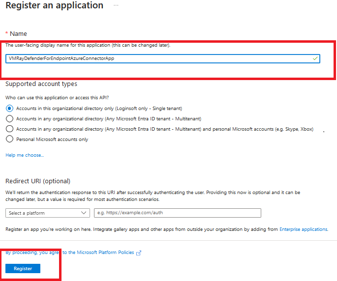

- In the application overview you can see `Application Name`, `Application ID` and `Tenant ID`.

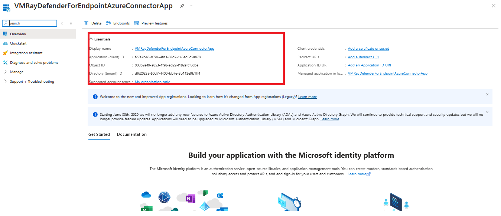

- After creating the application, we need to set API permissions for connector. For this purpose,
  - Click `Manage->API permissions` tab
  - Click `Add a permission` button
  - Select `APIs my organization uses`
  - Search `WindowsDefenderATP` and click the search result

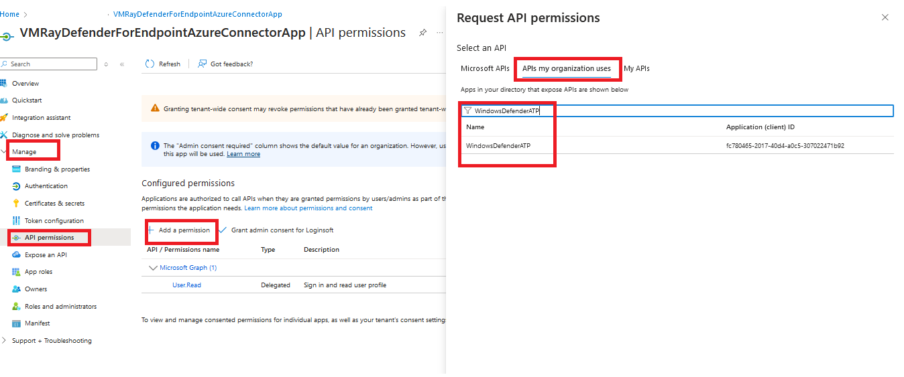

- On the next page select `Application Permissions` and check permissions according to the table below. And click `Add permissions` button below.

|       Category       |   Permission Name   |    Description   |
|:---------------------|:--------------------|:---------------- |
| Alert                | Alert.Read.All      | Needed to retrieve alerts and related evidence  |
| Alert                | Alert.ReadWrite.All | Needed to enrich alerts with sample information  |
| Machine              | Machine.LiveResponse | Needed to gather evidences from machines |
| Machine              | Machine.Read.All | Needed to retrieve information about machines  |
| Ti                   | Ti.Read.All | Needed to retrieve indicators  |
| Ti                   | Ti.ReadWrite | Needed to retrieve and submit indicators (application specific)|
| Ti                   | Ti.ReadWrite.All | Needed to retrieve and submit indicators (general) |
| Library              | Library.Manage | Needed to upload custom ps1 script for retrieving av related evidences |

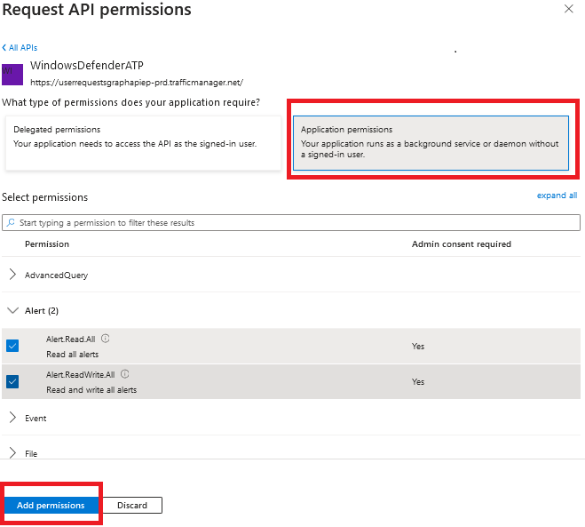

- After setting only the necessary permisions, click the `Grant admin consent for ...` button to approve permissions.

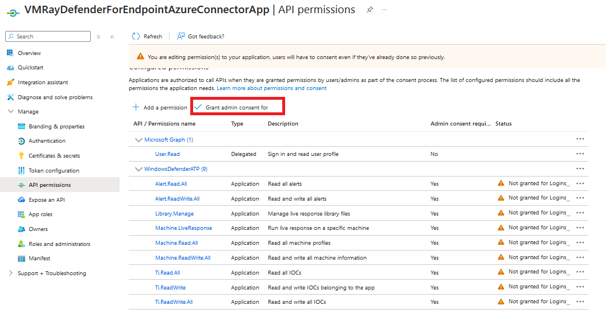

- We need secrets to access programmatically. For creating secrets
  - Click `Manage->Certificates & secrets` tab
  - Click `Client secrets` tab
  - Click `New client secret` button
  - Enter description and set expiration date for secret

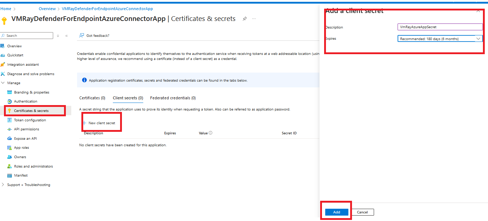

- Use Secret `Value` and `Secret ID` to configure connector.

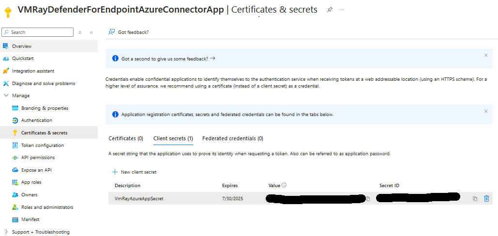

**Reference**
- [https://docs.microsoft.com/en-us/microsoft-365/security/defender-endpoint/api-hello-world](https://docs.microsoft.com/en-us/microsoft-365/security/defender-endpoint/api-hello-world)

### Activating Live Response and Automated Investigation

- Open [https://security.microsoft.com](https://security.microsoft.com)
- Open `Settings` page and `Endpoints` tab.
- Open `Advanced features`.
- Activate `Live Response`,  `Live Response for Servers` and `Live Response unsigned script execution` options.

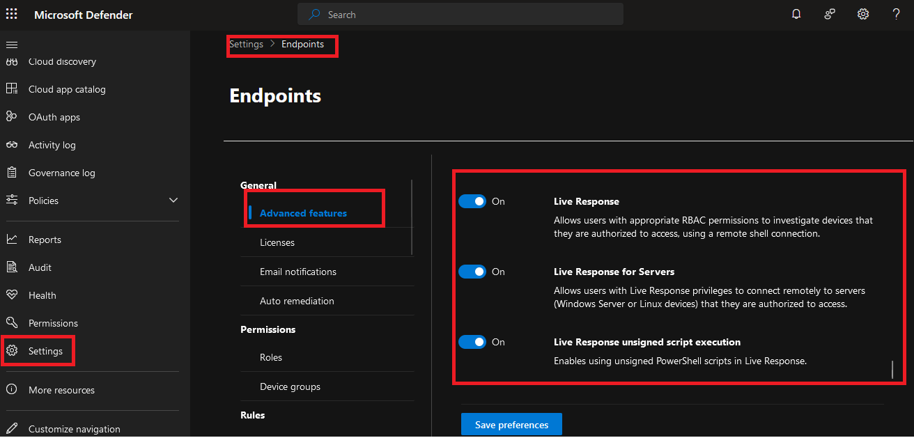

## Microsoft Azure Function App Installation And Configuration

### Deployment of Function App

- Open [https://portal.azure.com/](https://portal.azure.com) and search `Deploy a custom template` service.

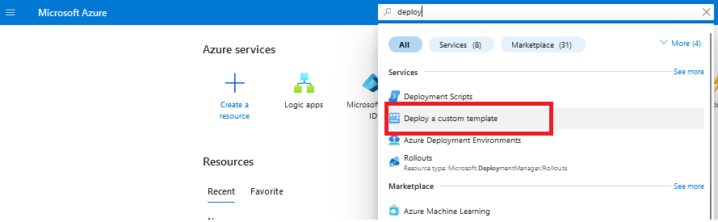

- On the next page select `Build your own template` in the editor.
  
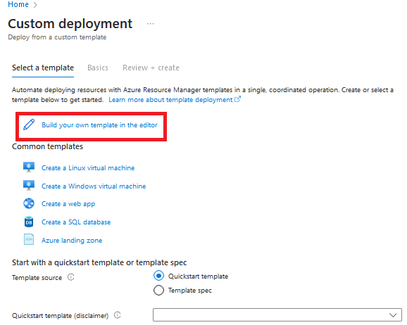

- Copy `azuredeploy.json` contents from the `FunctionApp` folder and save it.

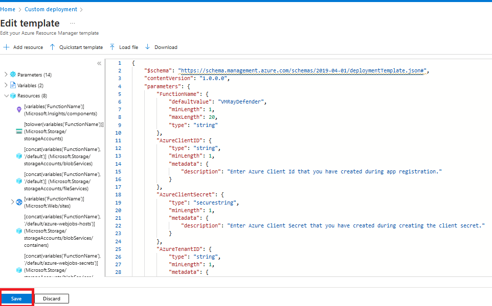

- On the next page, please provide the values accordingly.
  
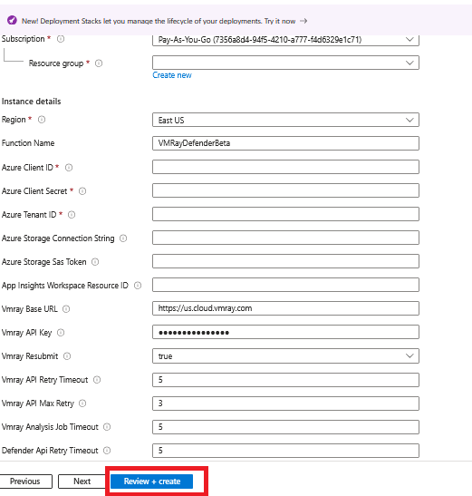

|       Fields       |   Description |
|:---------------------|:--------------------
| Subscription		| Select the appropriate Azure Subscription    | 
| Resource Group 	| Select the appropriate Resource Group |
| Region			| Based on Resource Group this will be uto populated |
| Function Name		| Please provide a function name if needed to change the default value|
| Azure Client ID   | Enter the Azure Client ID created in the App Registration Step |
| Azure Client Secret | Enter the Azure Client Secret created in the App Registration Step |
|Azure Tenant ID | Enter the Azure Tenant ID of the App Registration |
| Azure Storage Connection String| Please leave this empty |
| Azure Storage Saas Token| Please leave this empty |
| App Insights Workspace Resource ID | Go to `Log Analytics workspace` -> `Settings` -> `Properties`, Copy `Resource ID` and paste here |
| Vmray Base URL | VMRay Base URL |
| Vmray API Key | VMRay API Key |
| Vmray Resubmit | If true, the files will be resubmitted to VMRay analyser, even if the file hash was found in VMRay |
| Vmray API Retry Timeout | Provide maximum time to wait in minutes, when VMRay API is not responding |
| Vmray API Max Retry | Provide number of retries, when VMRay API is not responding |
| Vmray Analysis Job Timeout | Provide maximum time to wait in minutes, when VMRay Job submissions is not responding |
| Defender API Retry Timeout | Provide maximum time to wait in minutes, when Microsoft Defender API is not responding. |
| Defender API Max Retry | Provide number of retries, when Microsoft Defender API is not responding |
| Machine Availability Timeout | Provide maximum time to wait in minutes, when the machine is not responding |
| Machine Availability Retry | Provide number of retries, when machine is not responding |
| Create Indicators In Defender | If true, Indicators will be created in Microsoft Defender |
| Vmray Sample Verdict | Based on the selection, Indicators will be created in Microsoft Defender |
| Defender Indicator Action | The action that is taken if the indicator is discovered in the organization |
| Defender Indicator Alert | True if alert generation is required, False if this indicator shouldn't generate an alert|
	
- Once you provide the above values, please click on `Review + create` button.

### Deployment of Function App Zip package

- Download the zip package from the `FunctionApp` folder.
- Open [https://portal.azure.com/](https://portal.azure.com) and search `Storage accounts` service.

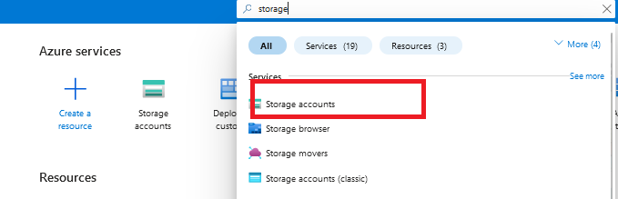

- Open the storage account, the name starts with `vmraystorage`.
- Go to `Storage Browser` -> `Blob Containers`, click on container, the name starts with `vmraycontainer`.
- Click on `Switch to Access key`.

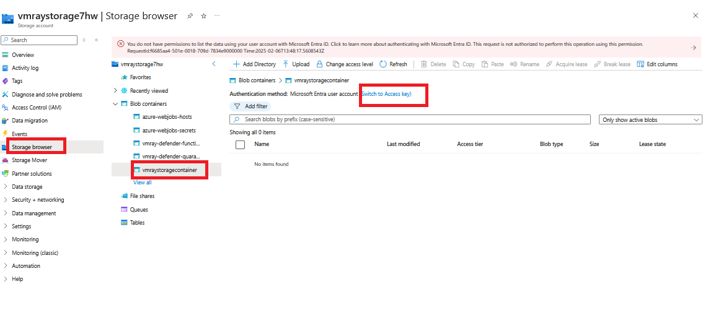

- Upload the downloaded zip package to the container. 

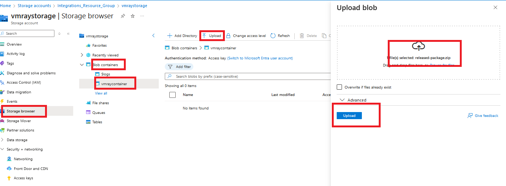

- Go to `Security + networking` -> `Access keys`, Copy `Connection string` and save it temporarily for next steps.

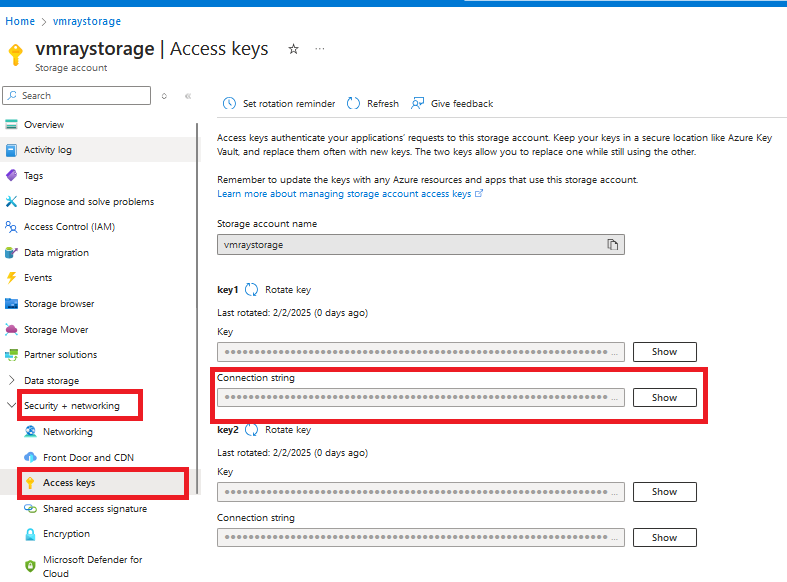

- Go to `Security + networking` -> `Shared access signature`, check all the options under `Allowed resource types`, provide `End`(expiration time, preferred 06 months), click on `Generate SAS and connection string`.

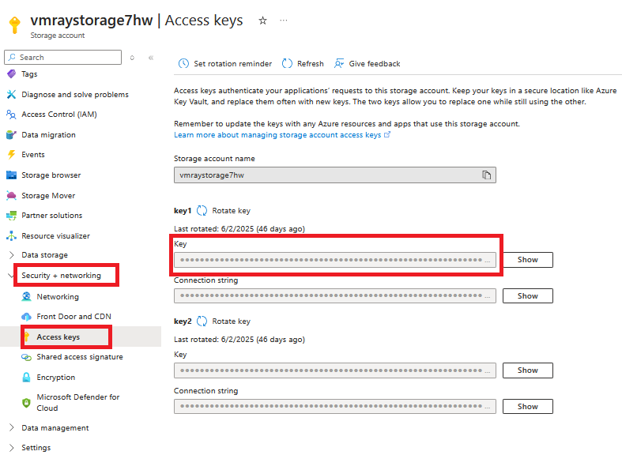

- Copy `SAS token` and save it temporarily for next steps.

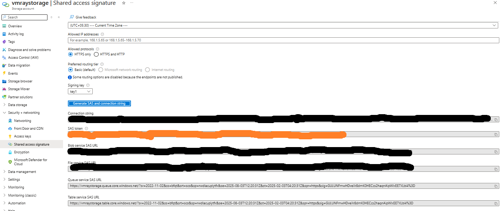

### Configuration of Function App

- Open [https://portal.azure.com/](https://portal.azure.com) and search `Function App` service.

- Open the VMRay FunctionApp name starts with `vmraydefender`.
- Go to `Settings`->`Environment variables`, double-click `AzureStorageConnectionString` and provide the connection string value copied in the previous step and click on `save`.
- Go to `Settings`->`Environment variables`, double-click `AzureStorageSaasToken` and provide the Saas token value copied in the previous step and click on `save`.
- Click on `Apply` -> `Confirm` buttons.

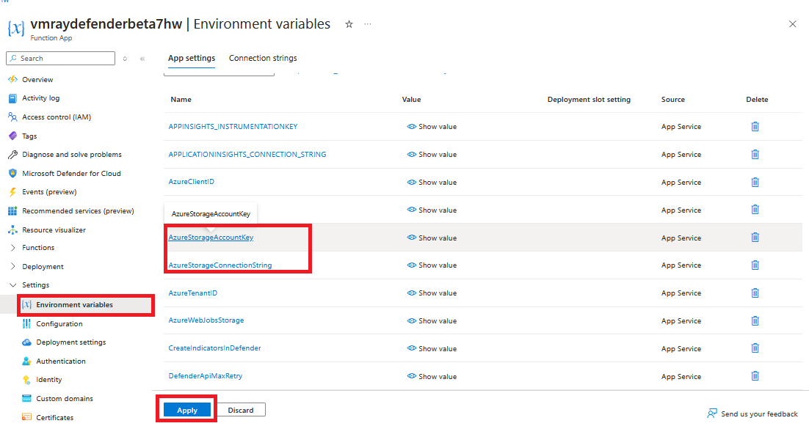

- Go to `Overview` -> click on `Restart`.

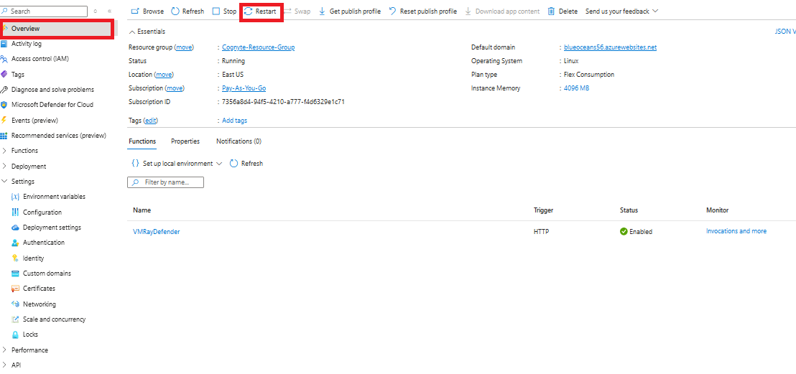

## Microsoft Azure Logic App Installation And Configuration

- Open [https://portal.azure.com/](https://portal.azure.com) and search `Deploy a custom template` service.

- On the next page select `Build your own template` in the editor.
  

- Copy `azuredeploy1.json` contents from the `LogicApp` folder and save it.
- On the next page, provide the appropriate `Subscription` and `Resource group` and click on `Review & create`.

  **Note**: When deploying the function app if you chose a different name, please kindly provide the same name here as well.
  
  
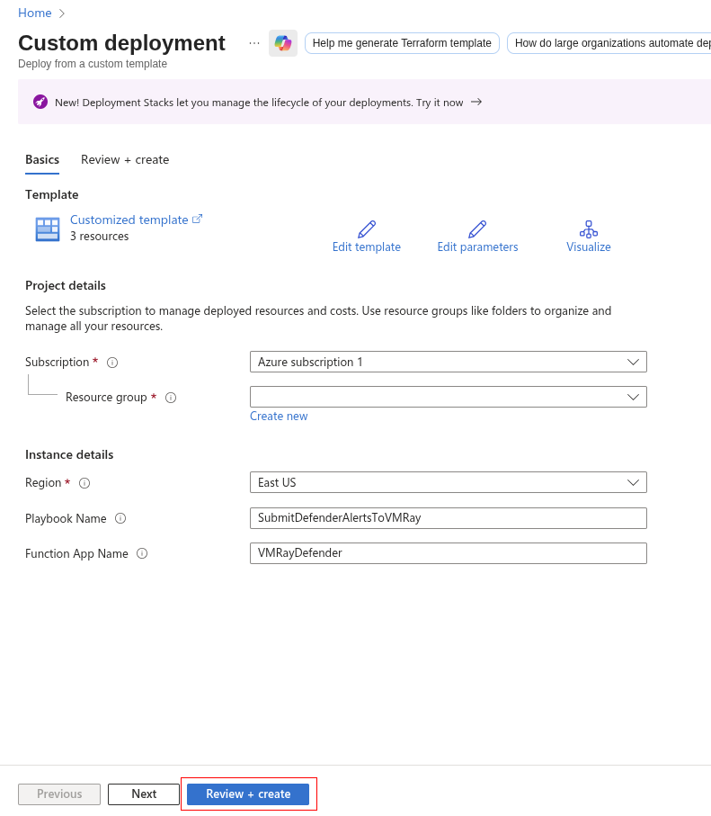

- Once the deployment is complete, go to newly deployed logic app, click on edit. The logic app will open in a designer mode.
- Click on the `WDATP Trigger`, click on `Add new`.

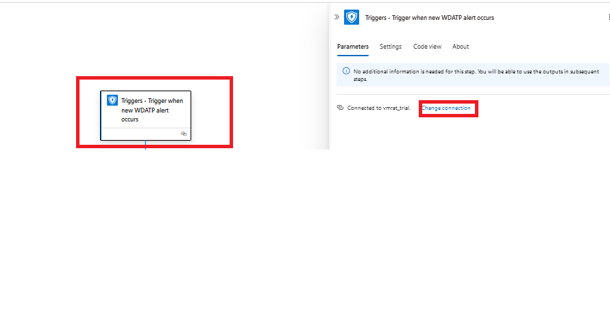

- On the next page, choose `Authentication` as `Service prinicipal`, and provide appropriate values.

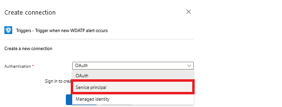
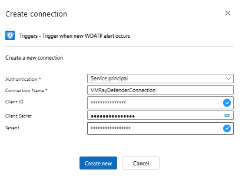

- Click on `Alerts - Get single Alert` action, click on `Cheange connection` and select the connection created above.

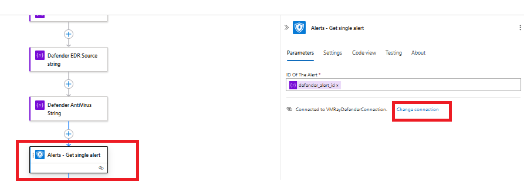

- Save the Logic App.

- Open [https://portal.azure.com/](https://portal.azure.com) and search `Deploy a custom template` service.

- On the next page select `Build your own template` in the editor.
  

- Copy `azuredeploy2.json` contents from the `LogicApp` folder and save it.
- On the next page, provide the appropriate `Subscription` and `Resource group` and click on `Review & create`.

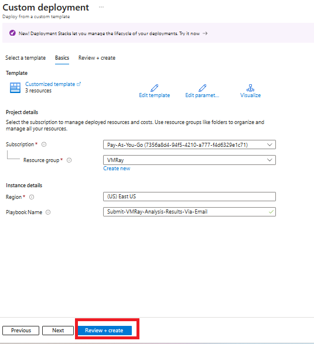

- Once the deployment is complete, go to newly deployed logic app, click on edit. The logic app will open in a designer mode.
- Click on the `Azure Blob Trigger`, click on `Change connection` and click on `Add new` on the following page.

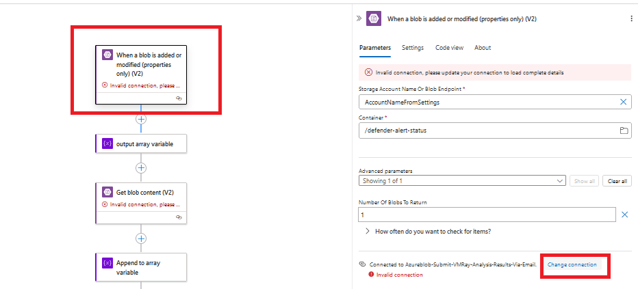

- Provide appropriate values and click on `Create new`.

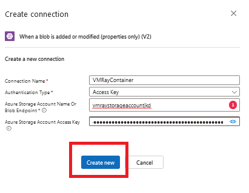

- Click on `folder icon` on the `Container box`.

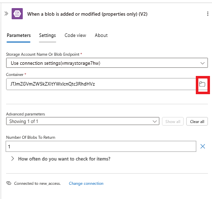

- Select folder named `vmray-defender-functionapp-status`

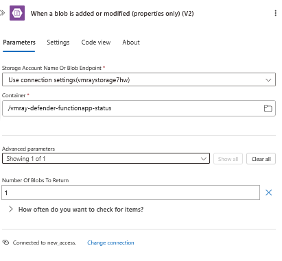  
  
- Click on `Get blob content` action, click on `Change connection`.

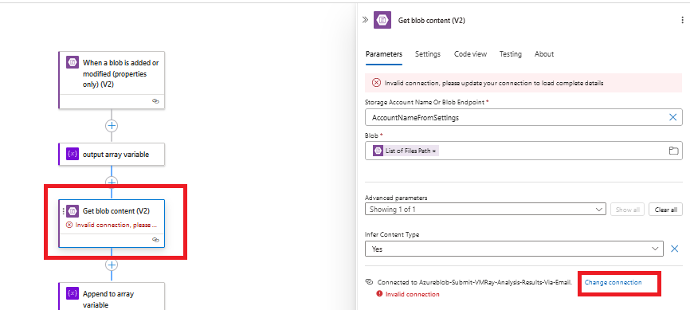

- Select the connection created in the above step.

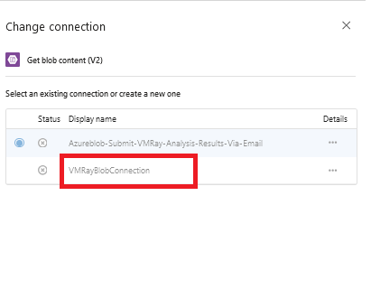

- Do the same `Delete blob` action, click on `Change connection` and select the connection created in the above step.

- Click on `Send an Email(V2)` action, click on `Change connection` and click on `Add new` , provide appropriate connection.

 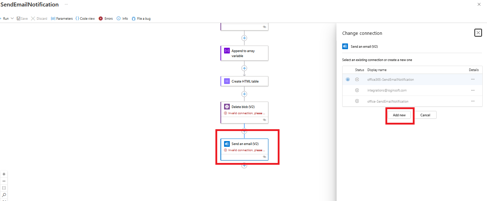 

- Save the Logic App.

## Expected Issues With LogicApps
- Logic App `SubmitSampleToVMRayAnalyser` runs will fail. This is a expected behaviour.
  
  
- ** Note** : Once the playbook `SubmitVMRayViaEmail` is properly configured, you will recieve notification once the anlayis is done 
