# Microsoft Defender for Endpoint Azure Connector for VMRay Advanced Malware Sandbox

**Latest Version:** 1.1.2 - **Release Date: 04/05/2026** 

## Table of Contents
- [Overview](#overview)
- [Solution Overview](#solution-overview)
- [Requirements](#requirements)
- [VMRay Configurations](#vmray-configurations)
- [Microsoft Defender for Endpoint Configurations](#microsoft-defender-for-endpoint-configurations)
  - [Creating Application for API Access](#creating-application-for-api-access)
  - [Activating Live Response and Automated Investigation](#activating-live-response-and-automated-investigation)
  - [Check Intune settings](#check-intune-settings)
- [Microsoft Azure Function App Installation And Configuration](#microsoft-azure-function-app-installation-and-configuration)
  - [Deployment of Function App](#deployment-of-function-app)
  - [Storage Account Keys](#storage-account-keys)
  - [Configuration of Function App](#configuration-of-function-app)
- [Microsoft Azure Logic App Installation And Configuration](#microsoft-azure-logic-app-installation-and-configuration)
  - [Submit-Defender-Alerts-To-VMRay Logic App Installation](#submit-defender-alerts-to-vmray-logic-app-installation)
- [Post-Deployment Configuration for Standard Plan](#post-deployment-configuration-for-standard-plan)
- [Disable Microsoft Defender for VMRay Storage Account](#disable-microsoft-defender-for-vmray-storage-account)
- [Expected Issues With LogicApps](#expected-issues-with-logicapps)
- [Debugging](#debugging)
- [Version History](#version-history)
- [Steps to Update from previous version](#steps-to-update-from-previous-version)
- [Automated Deployment (PowerShell Script)](#automated-deployment-powershell-script)

## Deployment Roadmap

Follow these steps **in order** for a first-time setup:

1. [VMRay Configurations](#vmray-configurations) — create the VMRay API key.
2. [Microsoft Defender for Endpoint Configurations](#microsoft-defender-for-endpoint-configurations) — register the Entra ID app, grant API permissions, enable Live Response, and check Intune settings.
3. [Microsoft Azure Function App Installation And Configuration](#microsoft-azure-function-app-installation-and-configuration) — deploy the Function App and wire up storage.
4. [Microsoft Azure Logic App Installation And Configuration](#microsoft-azure-logic-app-installation-and-configuration) — deploy the Logic App that feeds alerts to the Function App.
5. If you deployed the **Standard Plan** Logic App, complete [Post-Deployment Configuration for Standard Plan](#post-deployment-configuration-for-standard-plan).
6. [Disable Microsoft Defender for VMRay Storage Account](#disable-microsoft-defender-for-vmray-storage-account) so Defender for Storage doesn't strip malware samples before VMRay can analyze them.

If something isn't working after setup, see [Expected Issues With LogicApps](#expected-issues-with-logicapps) and [Debugging](#debugging).

> **Prefer automation?** Steps 1–4 above (App Registration, Function App, and Logic App deployment) can be run end-to-end with a single interactive PowerShell script instead of clicking through the Azure Portal. See [Automated Deployment (PowerShell Script)](#automated-deployment-powershell-script).

## Overview

This project integrates Microsoft Defender for Endpoint with VMRay's FinalVerdict and TotalInsight products.

The connector collects alerts and related evidence, then queries or submits the associated samples to the VMRay Sandbox for analysis. This helps your SOC team:
- **Understand the threat** behind each alert, with detailed analysis results.
- **Triage faster**, since VMRay's analysis is added as a comment directly on the Defender alert and incident.
- **Improve protection**, by extracting IOCs from each stage of the attack and submitting them as Defender indicators.

## Solution Overview

The connector is built using an Azure Logic App, an Azure Function App, and Azure Storage. Here's what happens end-to-end, from alert to enrichment:

1. The Logic App `SubmitDefenderAlertsToVMRay` watches for new AV/EDR alerts in Defender. When one appears, it sends the alert details to the Function App `VMRayDefender`.
2. `VMRayDefender` checks whether the alert contains a file or a URL, and whether that file hash or URL has already been analyzed by VMRay.
3. If it was already analyzed, `VMRayDefender` checks the `VmrayResubmitAfter` setting (default 7 days). If the previous submission is older than that, it resubmits the sample; otherwise it reuses the existing results.
4. For a **URL**, it's read directly from the alert evidence and submitted to VMRay. Any child sample VMRay downloads while analyzing the URL is treated as additional evidence and goes through the same flow. For a **file**, retrieval depends on how the alert was detected:
   - **EDR-detected files**: `VMRayDefender` downloads the file straight from the endpoint using a Defender live response `GetFile` command.
   - **Antivirus-detected (quarantined) files**: `VMRayDefender` uploads a PowerShell script to the endpoint and runs it via live response. The script reads the file directly from Defender's quarantine store and uploads it — still in its encrypted, quarantined form — to the `vmray-defender-quarantine-files` Azure Storage container. The file is never restored to disk or written to a temporary folder on the endpoint.
5. For quarantined files, `VMRayDefender` downloads the encrypted blob from that storage container and decrypts it in the Function App before submitting it to VMRay.
6. `VMRayDefender` waits for the VMRay analysis to complete, then receives the results back.
7. `VMRayDefender` posts the results as a note on the originating Defender alert.
8. If **Add Comments To Incident** is enabled, the same VMRay enrichment is also appended as a comment on the parent Defender incident (deduplicated so it isn't posted repeatedly for alerts belonging to the same incident).
9. If IOC submission is enabled, `VMRayDefender` sends the extracted IOCs to Microsoft Defender as indicators, so Defender can automatically alert on or block them.
10. If incident tagging is enabled, the incident is tagged with the most severe VMRay verdict and with each threat name VMRay identified.

**Important**: This solution can only analyze files that Defender Antivirus quarantined, that Defender EDR flagged, or that were downloaded from a URL (child sample). It cannot access files that were removed or blocked outright.

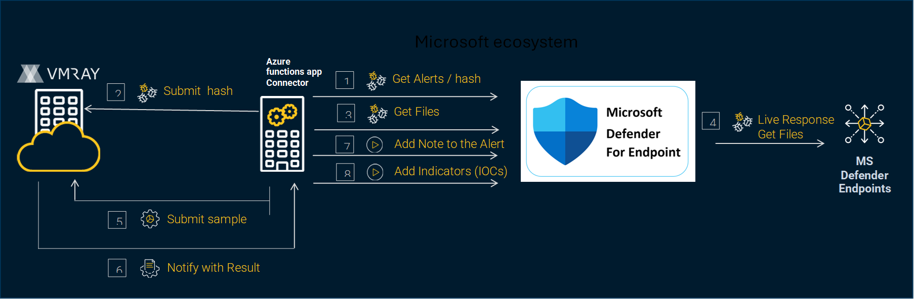

## Requirements

Before you begin, make sure you have:
- Microsoft Defender for Endpoint.
- VMRay Analyzer, VMRay FinalVerdict, and VMRay TotalInsight.
- A Microsoft Azure subscription, with access to:
  1. **Azure Functions – Flex Consumption plan** ([reference](https://learn.microsoft.com/en-us/azure/azure-functions/flex-consumption-plan)).
     Flex Consumption isn't available in every region — check [supported regions](https://learn.microsoft.com/en-us/azure/azure-functions/flex-consumption-how-to?tabs=azure-cli%2Cvs-code-publish&pivots=programming-language-python#view-currently-supported-regions) first. If your region isn't supported, use the Premium plan instead.
  2. **Azure Functions – Premium plan** ([reference](https://learn.microsoft.com/en-us/azure/azure-functions/functions-premium-plan)) — fallback if Flex Consumption isn't available in your region.
  3. **Azure Logic App – Consumption plan** ([reference](https://learn.microsoft.com/en-us/azure/logic-apps/logic-apps-pricing#consumption-multitenant)).
  4. **Azure Storage – Standard general-purpose v2**.

## VMRay Configurations

In the VMRay Console, create a Connector API key:

1. Create a dedicated user for this API key, so the key doesn't get deleted if an employee leaves.
2. Create a role with the permissions "View shared submission, analysis and sample" and "Submit sample, manage own jobs, reanalyse old analyses and regenerate analysis reports".
3. Assign this role to the user you created.
4. Log in as that user and create an API key under **Settings > Analysis > API Keys**.
5. Save the key — you'll need it when configuring the Azure Function App.

## Microsoft Defender for Endpoint Configurations

### Creating Application for API Access

> Open [https://portal.azure.com/](https://portal.azure.com) and search `Microsoft Entra ID` service.

> Click on `Add` and select `App registration.`

> Enter the name of application, select supported account types, and click on `Register`.

> In the application overview you can find `Application Name`, `Application ID` and `Tenant ID`.

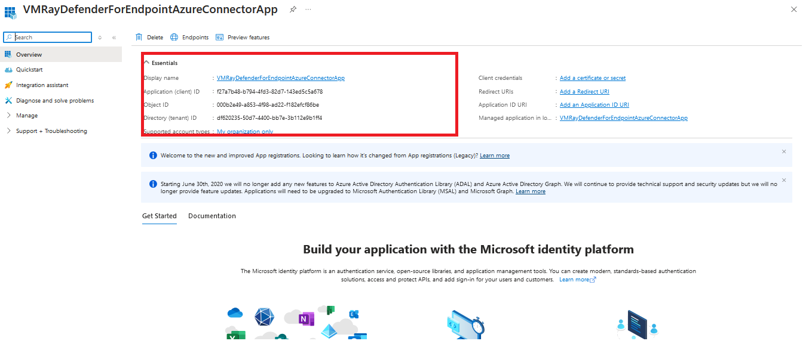

> After creating the application, we need to set API permissions for connector. For this purpose,
>  - Click `Manage > API permissions` tab.
>  - Click `Add a permission` button.
>  - Select `APIs my organization uses`.
>  - Search for `WindowsDefenderATP` and click on search result.

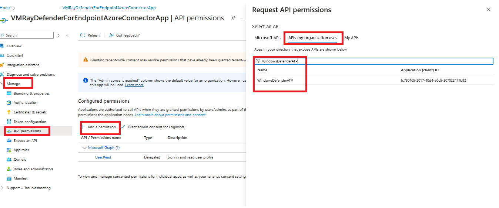

> On the next page, select `Application permissions` and check the permissions listed in the table below. Then click on `Add permissions`.
### WindowsDefenderATP
|       Category       |   Permission Name   | Description                                                            |
|:---------------------|:--------------------|:-----------------------------------------------------------------------|
| Alert                | Alert.ReadWrite.All | Needed to retrieve and enrich alerts with sample information           |
| Machine              | Machine.LiveResponse | Needed to gather evidences from machines                               |
| Machine              | Machine.Read.All | Needed to retrieve information about machines                          |
| Ti                   | Ti.ReadWrite | Needed to retrieve and submit indicators (application specific)        |
| Ti                   | Ti.ReadWrite.All | Needed to retrieve and submit indicators (general)                     |
| Library              | Library.Manage | Needed to upload custom ps1 script for retrieving AV related evidences |

> Follow the same steps as above to provide permission for `Microsoft Graph API`
### Microsoft Graph
| Category                      | Permission Name     | Description                                                           |
|:------------------------------|:--------------------|:----------------------------------------------------------------------|
| SecurityAlert.ReadWrite.All   | Alert.ReadWrite.All | Read and write to all security alerts                                 |
| SecurityIncident.ReadWrite.All| Incident.ReadWrite  | Read and write to all security incidents       |

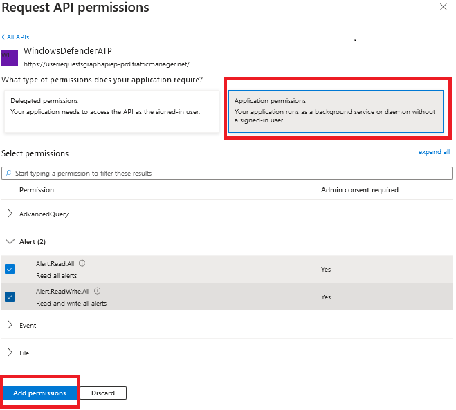

> After setting only the necessary permissions, click the `Grant admin consent for` button to approve permissions.

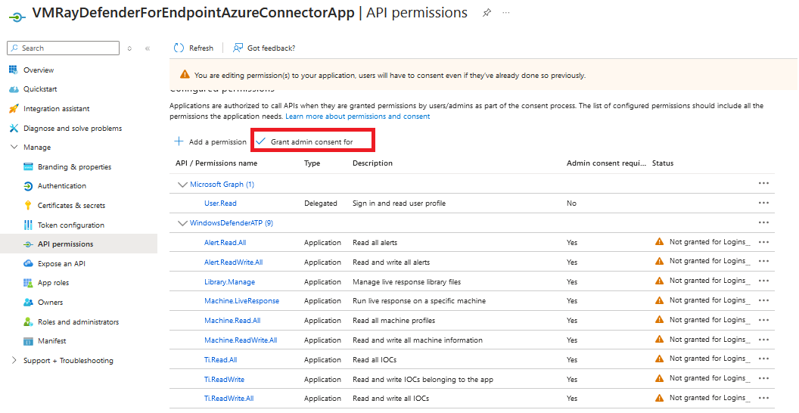

> We need secrets for programmatic access. Here's how to create them.
> - Click `Manage > Certificates & secrets` tab.
> - Click `Client secrets` tab.
> - Click `New client secret` button.
> - Enter description and set expiration date for secret.

> Use Secret `Value` and `Secret ID` to configure connector.

**Reference**
- [https://docs.microsoft.com/en-us/microsoft-365/security/defender-endpoint/api-hello-world](https://docs.microsoft.com/en-us/microsoft-365/security/defender-endpoint/api-hello-world)

### Activating Live Response and Automated Investigation

>- Open [https://security.microsoft.com](https://security.microsoft.com)
>- Go to `Settings` > `Endpoints` tab.
>- Select `Advanced features`.
>- Enable `Live Response`,  `Live Response for Servers` and `Live Response unsigned script execution`.

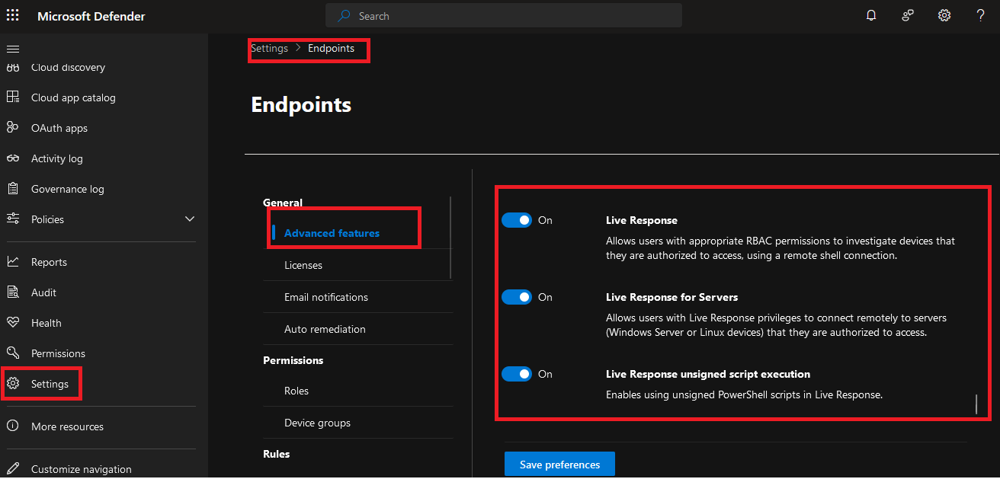

### Check Intune settings

>- Set the remediation action to "Quarantine: Moves files to quarantine" for all threat levels via Intune (or Group Policy). In Intune, go to **Endpoint security > Antivirus**, open the policy, and check the remediation settings under the Defender configuration.
  
## Microsoft Azure Function App Installation And Configuration

### Deployment of Function App 

#### Flex Consumption Plan

> Click on below button to deploy:

 

#### Premium Plan

> Click on below button to deploy:

  
  
  

> On the next page, please provide the values accordingly.
  
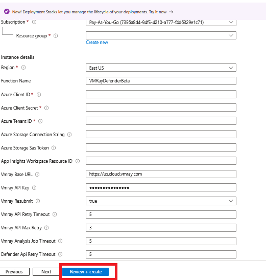

|       Fields       | Description                                                                                        |
|:---------------------|:---------------------------------------------------------------------------------------------------
| Subscription		| Select the appropriate Azure Subscription.                                                          | 
| Resource Group 	| Select the appropriate Resource Group.                                                              |
| Region			| Based on Resource Group this will be auto populated.                                                |
| Function Name		| Please provide a function name if needed to change the default value.                               |
| Function App Plan SKU *(Premium plan only)* | The Premium plan tier to use: `EP1`, `EP2`, or `EP3` (default `EP1`).                |
| Storage Account Type *(Premium plan only)* | Redundancy for the deployed storage account: `Standard_LRS`, `Standard_GRS`, or `Standard_RAGRS` (default `Standard_LRS`). |
| Azure Client ID   | Enter the Azure Client ID created in the App Registration Step.                                     |
| Azure Client Secret | Enter the Azure Client Secret created in the App Registration Step.                                 |
|Azure Tenant ID | Enter the Azure Tenant ID of the App Registration.                                                  |
| Azure Storage Connection String| Please leave this empty for now.                                                                           |
| Azure Storage Account Key| Please leave this empty for now.                                                                            |
| App Insights Workspace Resource ID | Go to `Log Analytics workspace` > `Settings` > `Properties`, Copy `Resource ID` and paste here.   |
| Vmray Base URL | VMRay Base URL, either https://eu.cloud.vmray.com or https://us.cloud.vmray.com                        |
| Vmray API Key | VMRay API Key                                                                                      |
| Vmray Resubmit After | Resubmit when the previous analysis is older than X days. The value represents the number of days (range 0–100), where 0 means resubmit every time. |
| Vmray API Retry Timeout | Provide maximum time to wait in minutes, when VMRay API is not responding.                          |
| Vmray API Max Retry | Provide number of retries, when VMRay API is not responding.                                        |
| Vmray Analysis Job Timeout | Provide maximum time to wait in minutes, when VMRay Job submissions is not responding.              |
| Defender API Retry Timeout | Provide maximum time to wait in minutes, when Microsoft Defender API is not responding.            |
| Defender API Max Retry | Provide number of retries, when Microsoft Defender API is not responding.                           |
| Machine Availability Timeout | Provide maximum time to wait in minutes, when the machine is not responding.                      |
| Machine Availability Retry | Provide number of retries, when machine is not responding.                                          |
| Create Indicators In Defender | If true, Indicators will be created in Microsoft Defender.                                          |
| Indicator Expiration In Days |	Please specify the number of days the indicator should remain valid.             |
| Add Tags To Incident |	If true, VMRay verdict and threat names will be added to incidents tag in Defender console. If you do not triage from the incident view, set it to false. |
| Add Comments To Incident |	If true, VMRay enrichment comments will be appended to the parent incident of each processed alert. |
| Vmray Sample Verdict | Based on the selection, Indicators will be created in Microsoft Defender.                          |
| Defender Indicator Action For Malicious IP Address URL  | The action that is taken if the indicator is Malicious URL or IP Address discovered in the organization.                                            |
| Defender Indicator Action For Suspicious IP Address URL | The action that is taken if the indicator is Suspicious URL or IP Address discovered in the organization.                                           |
| Defender Indicator Action For Malicious File            | The action that is taken if the indicator is Malicious File discovered in the organization.                                                         |
| Defender Indicator Action For Suspicious File           | The action that is taken if the indicator is Suspicious File discovered in the organization.                                                        |
| Defender Indicator Alert | If true, Defender indicators created by VMRay will also generate an alert. If false, the indicator is created without generating an alert.        |
| Add AlertId Tags |If true, Alert ID will be added as tags to VMRay submissions. This cannot be used before VMRay platform release 2026.2 as special character in tags are not supported before that.         |
| Fetch Quarantined Files| If true, quarantined files will be pulled from host machine and uploaded to VMRay for analysis. If false, only URLs from AV alerts and files linked to EDR alerts are collected          |
| Filter Alert Title With | If set, only alerts whose title contains one of these values will be processed. Provide comma-separated values, e.g. `vmray, vmray to analyze`.          |
	
> Once you enter the values, please click on `Review + create` button.

### Storage Account Keys

> Open [https://portal.azure.com/](https://portal.azure.com) and search `Storage accounts` service.

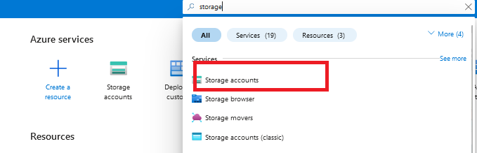

> - Open the storage account (name starts with `vmraystorage`).
> - Go to `Security + networking` > `Access keys`.
> - Copy the `Connection string` and save it temporarily for the next steps.

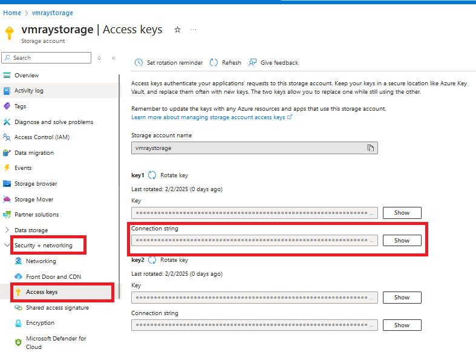

> - Go to `Security + networking` > `Access keys`.
> - Copy the `Key` and save it temporarily for the next steps.

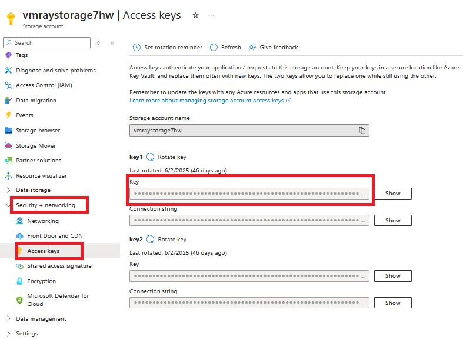

### Configuration of Function App

> Open [https://portal.azure.com/](https://portal.azure.com) and search `Function App` service.

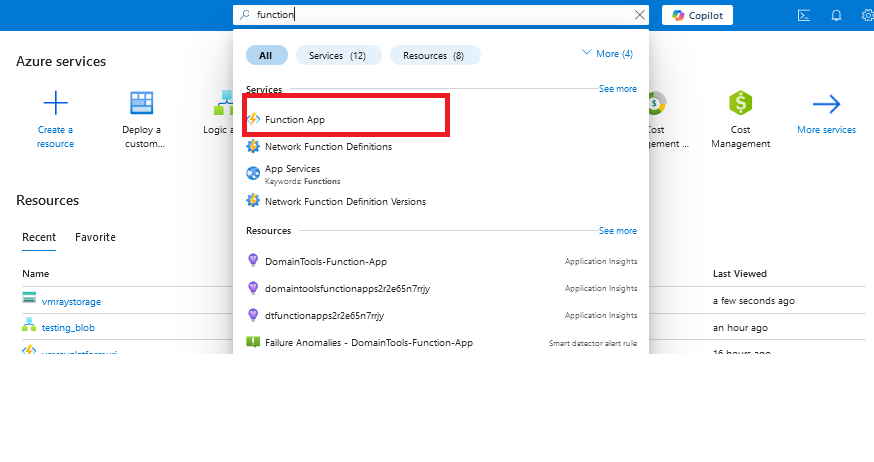

>- Open the VMRay FunctionApp name starts with `vmraydefender`.
>- Go to `Settings` > `Environment variables`, double-click `AzureStorageConnectionString` and provide the `Connection string` value copied in the previous step and click on `save`.
>- Go to `Settings` > `Environment variables`, double-click `AzureStorageAccountKey` and provide the `Key` value copied in the previous step and click on `save`.
>- Click on `Apply` > `Confirm`.

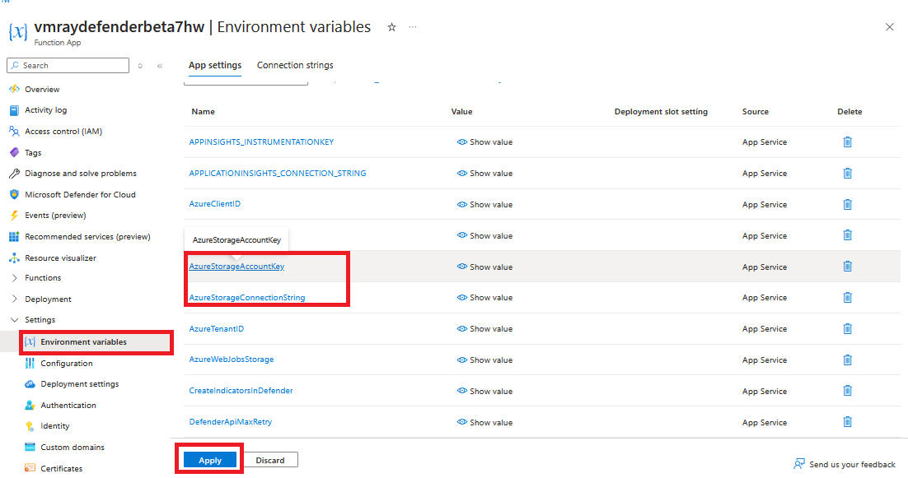

> Go to `Overview`, click on `Restart`.

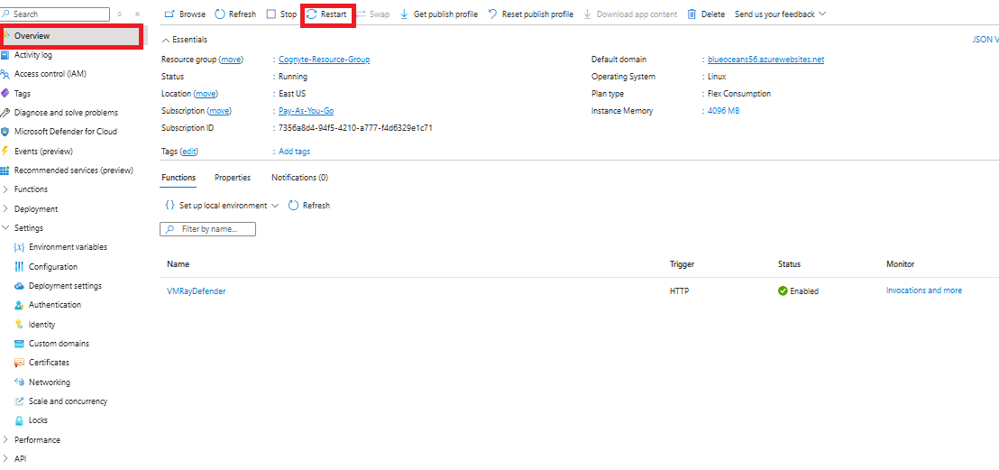

## Microsoft Azure Logic App Installation And Configuration

### Submit-Defender-Alerts-To-VMRay Logic App Installation

>This playbook is **required**. The Logic App collects Defender alerts and sends them to the VMRay Function App connector for further processing.

#### Consumption Plan
> Click on below button to deploy:

  

> On the next page, provide the appropriate `Subscription` and `Resource group` and click on `Review & create`.
>  **Note**: If you chose a different name when deploying the Function App, please enter that name here.

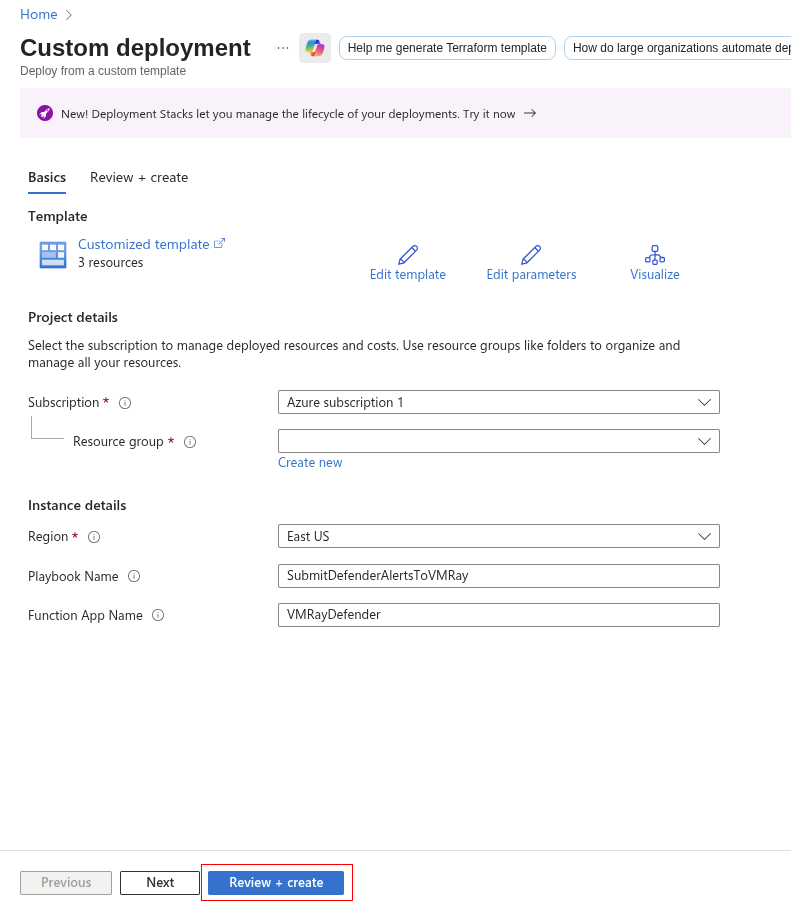

> Once the deployment is complete, go to newly deployed logic app, click on `edit`. The logic app will open in a designer mode.
 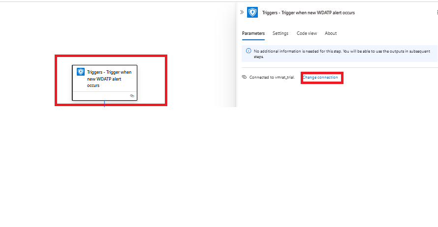

> On the next page, choose `Authentication` as `Service principal`, and provide the `ClientId`, `Client Secret` and `Tenant` values created via Entra ID app registration previously.

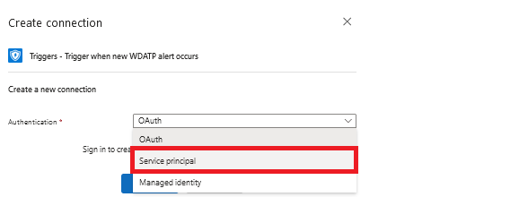
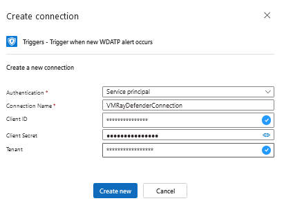

> Click on `Alerts - Get single Alert` action, click on `Change connection` and select the connection created above.

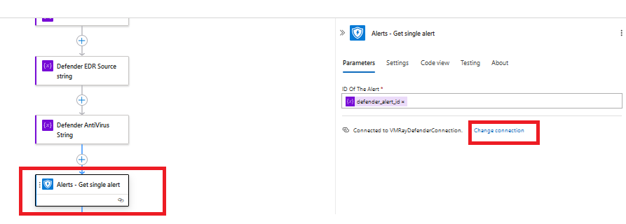

#### Standard Plan

> Click on below button to deploy

  
  > **Note:** If you chose a different name when deploying the Function App, please enter that name here.

> Enter all the required values.

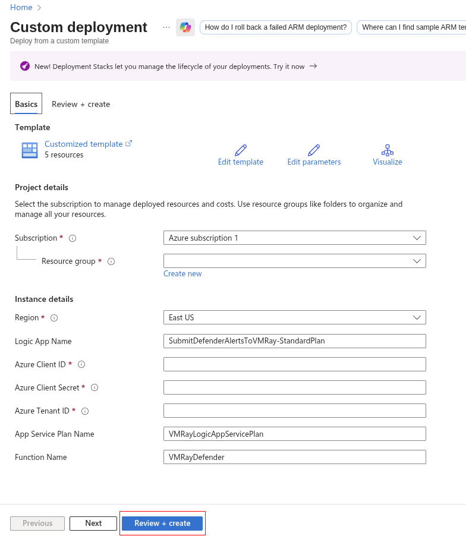

### Optional: Email Notification Playbook

> `LogicApp/azuredeploy2.json` deploys an optional `SendEmailNotification` Logic App that uses an Office 365 connection to send email alerts. It is not required for the core VMRay/Defender enrichment flow above — deploy it only if you want email notifications and are prepared to configure the Office 365 and Azure Blob connections it requires.

## Post-Deployment Configuration for Standard Plan

### Step 1: Authorize the API Connection

>From the deployment page, click on the **`wdatp`** API connection.  

   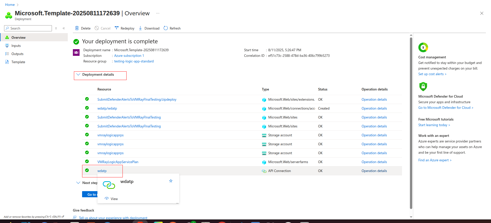

>Go to `General → Edit API Connection`

>Click **`Authorize`**, select your account, and then click **`Save`**.  

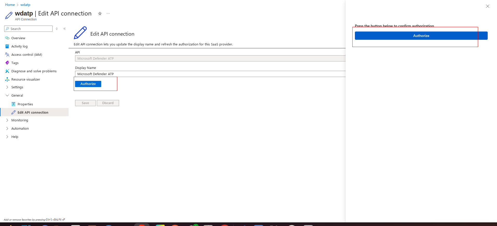

### Step 2: Complete Logic App Connections

>Go to the newly deployed Logic App.

> Go to `Workflow → Connections → JSON View`

>Update the following fields:  
>- `subscriptionId`
>- `resourceGroupName`
>- `location`
>- `functionAppName`
>- `functionKey`

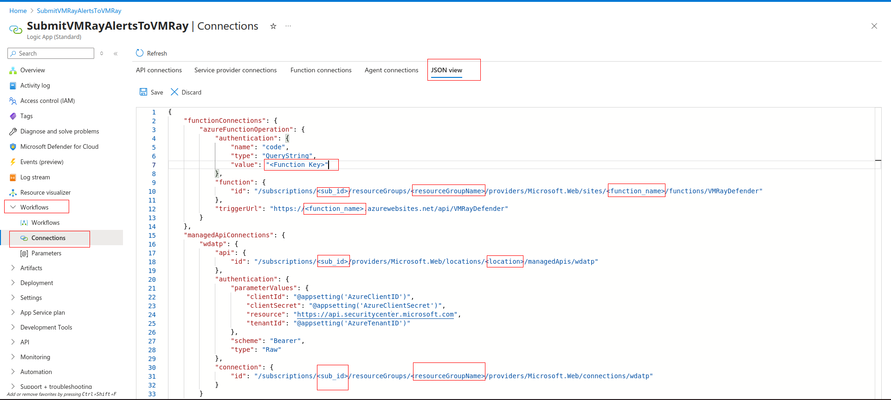

#### Get Function App Name and Key:
> Go to your Function App in Azure.

> Select **`VMRayDefender`**. **Note**: If you chose a different name during deployment, select that name instead.

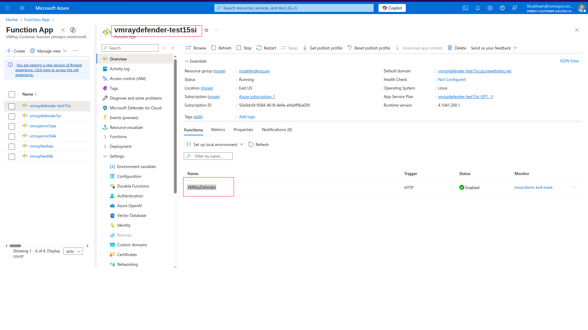

> Click on **Function Keys** and copy the `key` value.  

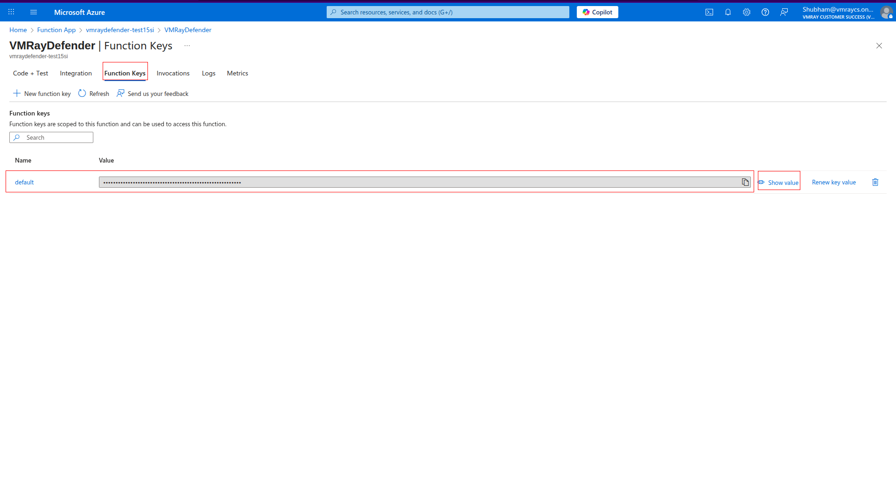

> Click **`Save`** after updating the JSON.

### Step 3: Configure Trigger Authentication

> Open the Logic App in **Designer mode**.

> Select the trigger; **`Triggers - Trigger when new WDATP alert occurs`**  

> Set Authentication:
>  - Type: **Service Principal**
>   - Enter values for
>     - `Client ID`
>     - `Client Secret`
>     - `Tenant ID`

> Click on **`Get single alert`** action:
>   - Click **`Change connection`**
>- Select the previously created connection  

### Step 4: Configure Function App Connection

>Scroll to the **Function App** section at the bottom of the Logic App.

>Click **`Change connection`**.  

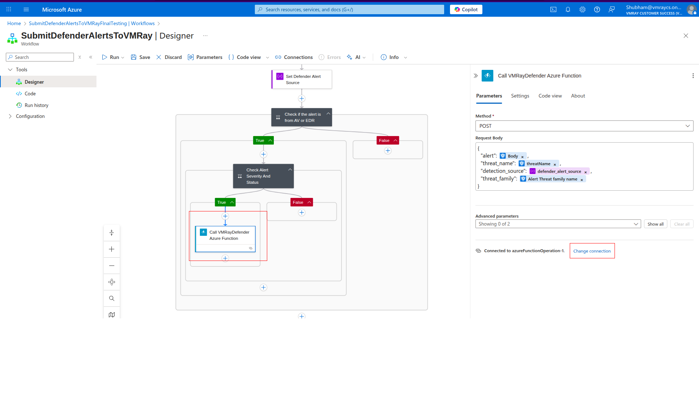

>Select **`Add new`**, then choose your Function App.  

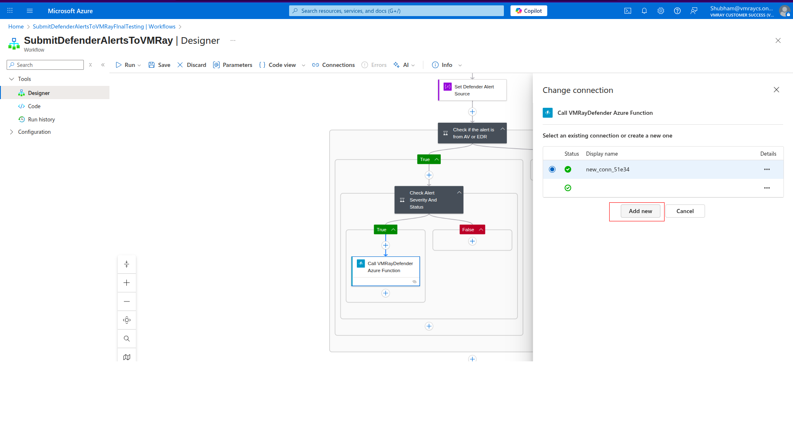  
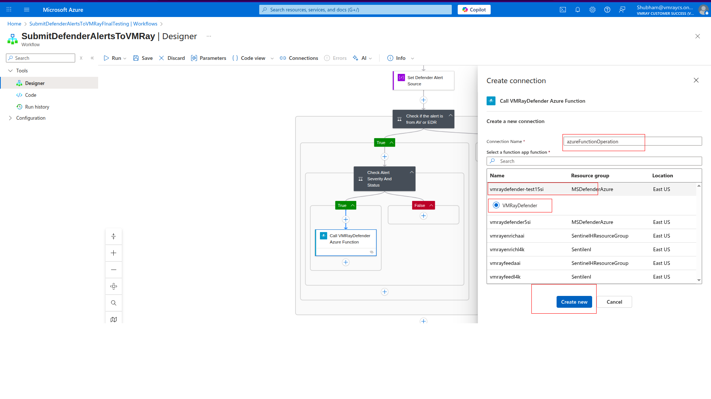

> Click **`Save`** at the top of the workflow.  

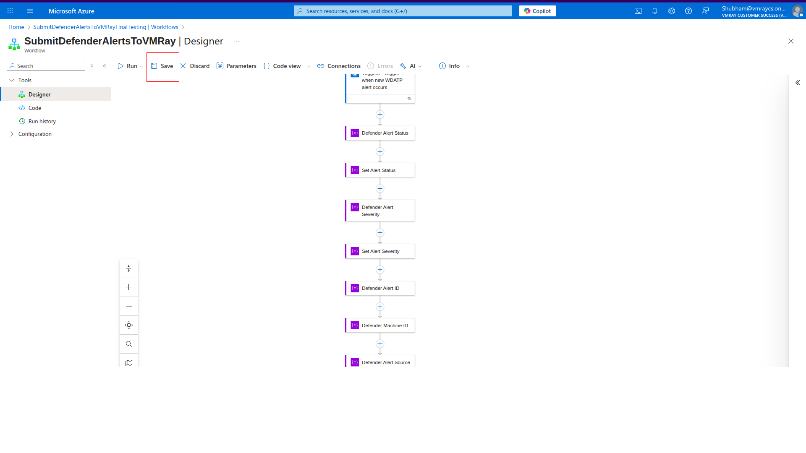

#### Filtering the Defender alerts

- If you would like to filter the Defender alerts based on alert severity or alert status, click on `Parameters`, and set the `DefenderAlertSeverity` and `DefenderAlertStatus` property values accordingly.
- Allowed values for `DefenderAlertSeverity` parameter are listed below, kindly note all values are case-sensitive
	* High
	* Medium
	* Low
	* Informational
	* UnSpecified	
- For example, to filter by "Medium" and "High" severity, set the value to `["Medium","High"]`.
- Allowed values for `DefenderAlertStatus` parameter are listed below, kindly note all values are case-sensitive
	* New
	* InProgress
	* Resolved
	* Unknown
- For example, to filter by "New" status only, set the value to `["New"]`.

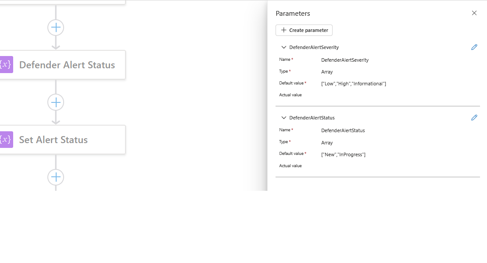

- Save the Logic App.

## Disable Microsoft Defender for VMRay Storage Account

> Defender for storage will remove any malware uploaded to a Blob storage. If you are using Microsoft Defender for Storage you need to exclude the VMRay storage.

- Open [https://portal.azure.com/](https://portal.azure.com) and search `Storage accounts` service.

- Open the storage account, the name starts with `vmraystorage`.
- Go to `Microsoft Defender For Cloud` > `settings`, disable the `Microsoft Defender For Storage` and click on `save`.

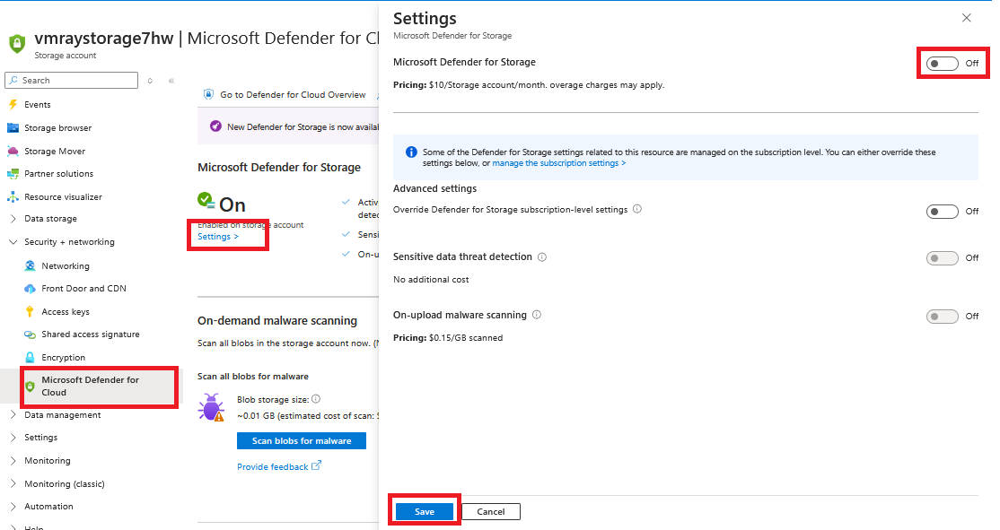

## Automated Deployment (PowerShell Script)

> As an alternative to manually clicking through the Azure Portal steps above, `Scripts/Deploy-VMRayDefenderConnector.ps1` is an interactive PowerShell script that automates the App Registration, Function App, and Logic App deployment phases (including the storage key and credential wiring steps that are otherwise manual). It's designed to run from Azure Cloud Shell.
>
> Two things still require a manual click, since they can't be done via Azure APIs: the Defender Advanced Features / Intune settings, and the Logic App connection authorization. The script prints exactly what to do for each, at the right moment.
>
> See [docs/AUTOMATED-DEPLOYMENT.md](docs/AUTOMATED-DEPLOYMENT.md) for the full guide, including prerequisites, step-by-step usage, re-deployment / existing App Registration reuse, and troubleshooting.

## Expected Issues With LogicApps
> Runs of the `SubmitDefenderAlertsToVMRay` Logic App will show as failed after 2 minutes. This is expected behavior, not an actual issue.

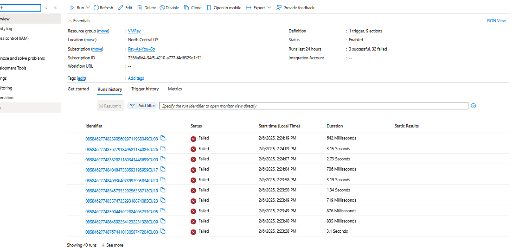

    
## Debugging
- To debug and check logs after receiving an email, follow these steps:
  * Navigate to the Azure Function App.
  * Select the function that starts with "vmraydefender".
  * In the Function section below, choose "VMRayDefender".
     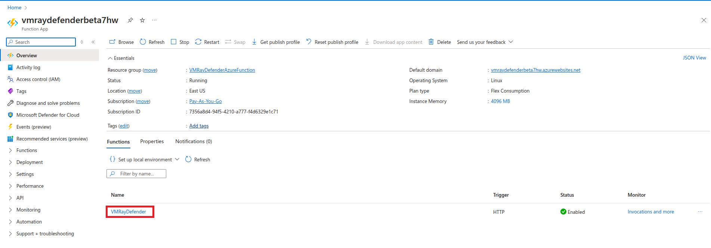

  * Go to the Invocation tab.
     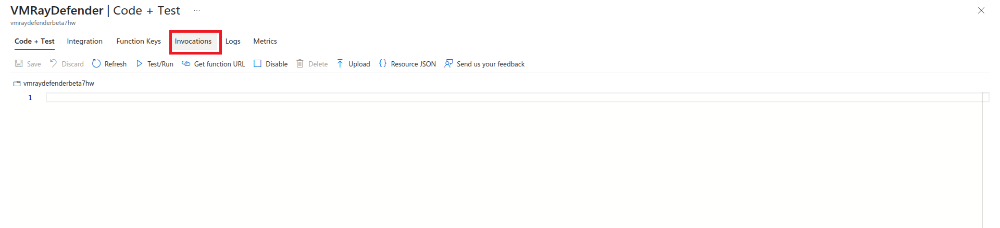

  * Find the execution based on the start time received in the email and match it with the invocation_id from the email.
     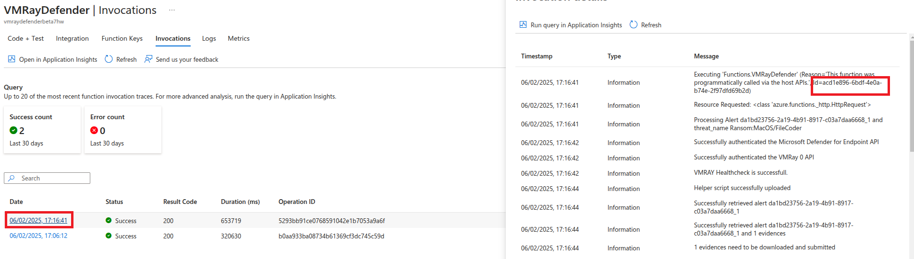

  * Review all logs under the selected execution.
     

## Version History

| Version        | Release Date | Release Notes
|:---------------|:-------------|:---------------- |
| 1.1.2          | `04-05-2026` | <ul><li>Improvement: Added option to also append VMRay enrichment comments to the parent Defender incident (controlled by `Add Comments To Incident`). Includes per-incident dedup to avoid repeated posts across multiple alerts of the same incident.</li></ul> |
| 1.1.1          | `27-02-2026` | <ul><li>URLs are submitted faster.</li><li>Filter per alert title.</li><li>Setting to disable querying quarantine file.</li></ul> |
| 1.1.0          | `11-12-2025` | <ul><li>URL analysis: URL included in the alert are also analyzed, as well as any potential file (Child sample) downloaded from the url.</li><li>New Configuration Options Added: Defender indicator actions can be configured separately for malicious and suspicious IOCs, an per file and IP/URL. Configurable expiration time for Defender indicators.</li><li>Incident tags: Add tags to incidents with VMRay most severe verdict and threat names</li><li>Alerts are now enriched with live response status details if errors are encountered during execution</li><li>Threat names are now sanitized by removing special characters before being included in Incident tags and Alert comments</li><li>More context to Defender indicators: link to VMRay sample and timestamp added.</li><li>VTI ordered by severity</li></ul> |
| 1.0.0          | `26-05-2025` | <ul><li>Removed triple alert from VMRay IOC indicators: Previously, VMRAY submitted for each malicious files three hash values. With this change it only submit the SHA256 hash value.</li><li>Clear tags: One tag indicates Defender-AV or Defender-EDR detected the threat. Another tag indicates the threat name seen in Defender allowing to easily map VMRay submission and Defender alerts.</li><li>Retry logic and default adjusted.</li></ul> |
| 1.0.0-beta.2 	 | `25-03-2025` | <ul><li>Added the ability to filter the Defender Alerts by alert severity and alert status</li><li>Removed the dependency of Azure SaS Token from function app configuration</li><li>Bug Fixes</li></ul> |
| 1.0.0-beta.1   | `07-02-2025` | Initial Release |

## Steps to Update from previous version

### Deploy Function App
> Please redeploy the Function App, following the instructions given in the document.
>- [Deployment of Function App](#deployment-of-function-app)

### Deploy Logic App
> Please redeploy the Logic App, following the instructions given in the document.
>- [Submit-Defender-Alerts-To-VMRay Logic App Installation](#submit-defender-alerts-to-vmray-logic-app-installation)
