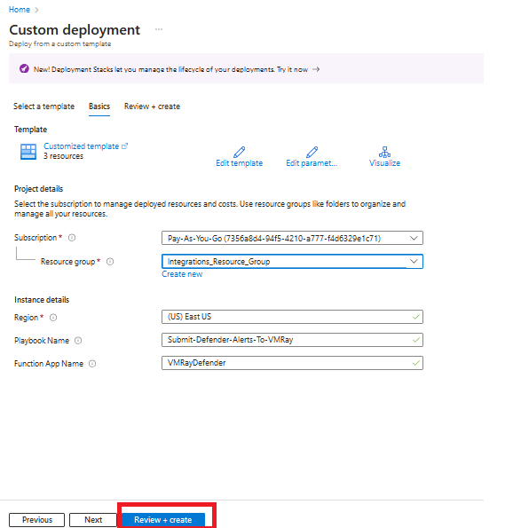
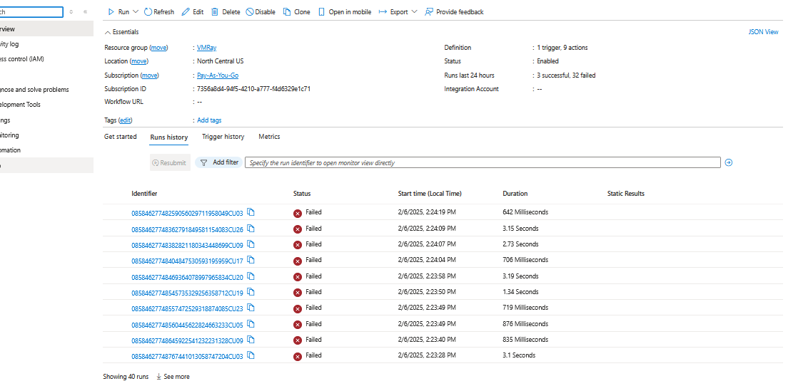

# Microsoft Defender for Endpoint Azure Connector for VMRay Advanced Malware Sandbox

**Latest Version:** 1.1.0 - **Release Date: 11/12/2025** 

## Overview

This project is an integration between Microsoft Defender for Endpoint and VMRay products: FinalVerdict and TotalInsight. 
The connector collects alerts and related evidences, and query or submit these samples into VMRay Sandbox.
It allows the SOC team to better understand the threat behind the alert.
It accelerates the triage of alerts by adding comments to the alert in MS Defender Console with the analysis of the sample.
It improves protection by extracting IOCs from the different stage of the attack and submiting them as Defender indicators.

## Solution Overview
- The connector is built using Azure logic app, Azure functions app and Azure Storage.
  1. Azure Logic app `SubmitDefenderAlertsToVMRay` monitors the alerts from MS Defender as soon any AV/EDR alerts are generated. If any AV/EDR alert is found, it will send the alert details to the Azure function app `VMRayDefender`.
  2. Azure function app `VMRayDefender` checks if the alert contains a file or a URL and checks if the file hash or the URL has already been analyzed by VMRay.
  3. If the hash/URL was already analysed, the system checks the setting VmrayResubmitAfter (default 7 days). if the last submission was older than this value, it resubmits the sample to VMRay. If not it uses results from previous submission.
  4. For file, Azure function app `VMRayDefender` requests the file from Microsoft Defender by starting a live response session. For URL, it gets it directly from the alert evidence.
  5. For file, Microsoft Defender starts a live response session that run PowerShell code on the endpoint. The PowerShell moves the files out of quarantine to a temporary folder before sending to Azure storage(vmray-defender-quarantine-files) container. 
  6. For file, Azure function app `VMRayDefender` monitors the Azure storage(vmray-defender-quarantine-files) container and submits the quarantine file to VMRay.
  7. Azure function app `VMRayDefender` will wait till the submission of the file or URL is completed. When the VMRay analysis is done VMRay results are sent back to the Azure function app `VMRayDefender`.
  8. The Azure function app `VMRayDefender` post the results as a note within the relevant defender alert.
  9. If configured to send IOCs, the Azure function app `VMRayDefender` provides the IOCs as the indicators to Microsoft Defender that use them for automatically alerting or blocking.
  10. If configured to update Defender Incident tags, it will add a tag with the most severe VMRay alert within the incident, as well as a tag with each threat name identified by VMRay.
   
**Important**: This solution can only analyze files quarantined by Defender Antivirus, flagged by Defender EDR or downloaded from a URL (child sample). It cannot access files that were removed or blocked outright. 

## Requirements
- Microsoft Defender for Endpoint.
- VMRay Analyzer, VMRay FinalVerdict, VMRay TotalInsight.
- Microsoft Azure
  1. Azure functions with Flex Consumption plan.
     Reference: https://learn.microsoft.com/en-us/azure/azure-functions/flex-consumption-plan
	 **Note: Flex Consumption plans are not available in all regions, please check if the region your are deploying the function is supported, if not we suggest you to deploy the function app with premium plan. **
	 Reference: https://learn.microsoft.com/en-us/azure/azure-functions/flex-consumption-how-to?tabs=azure-cli%2Cvs-code-publish&pivots=programming-language-python#view-currently-supported-regions
  2. Azure functions Premium plan.
	 Reference: https://learn.microsoft.com/en-us/azure/azure-functions/functions-premium-plan
  3. Azure Logic App with Consumption plan.
     Reference: https://learn.microsoft.com/en-us/azure/logic-apps/logic-apps-pricing#consumption-multitenant
  4. Azure storage with Standard general-purpose v2.

## VMRay Configurations

- In VMRay Console, you must create a Connector API key by following the steps below:
  
  1. Create a user dedicated to this API key (to avoid that the API key is deleted if an employee leaves)
  2. Create a role that allows to "View shared submission, analysis and sample" and "Submit sample, manage own jobs, reanalyse old analyses and regenerate analysis reports".
  3. Assign this role to the created user
  4. Login as this user and create an API key by opening Settings > Analysis > API Keys.
  5. Please save the keys, which will be used in configuring the Azure Function.

     
## Microsoft Defender for Endpoint Configurations

### Creating Application for API Access

> Open [https://portal.azure.com/](https://portal.azure.com) and search `Microsoft Entra ID` service.

> Click on `Add` and select `App registration.`

> Enter the name of application, select supported account types, and click on `Register`.

> In the application overview you can find `Application Name`, `Application ID` and `Tenant ID`.

> After creating the application, we need to set API permissions for connector. For this purpose,
>  - Click `Manage > API permissions` tab.
>  - Click `Add a permission` button.
>  - Select `APIs my organization uses`.
>  - Search for `WindowsDefenderATP` and click on search result.

> On the next page, select `Application permissions` and check the permissions listed in the table below. Then click on `Add permissions`.
### WindowsDefenderATP
|       Category       |   Permission Name   | Description                                                            |
|:---------------------|:--------------------|:-----------------------------------------------------------------------|
| Alert                | Alert.ReadWrite.All | Needed to retrieve and enrich alerts with sample information           |
| Machine              | Machine.LiveResponse | Needed to gather evidences from machines                               |
| Machine              | Machine.Read.All | Needed to retrieve information about machines                          |
| Ti                   | Ti.ReadWrite | Needed to retrieve and submit indicators (application specific)        |
| Ti                   | Ti.ReadWrite.All | Needed to retrieve and submit indicators (general)                     |
| Library              | Library.Manage | Needed to upload custom ps1 script for retrieving AV related evidences |

> Follow the same steps as above to provide permission for `Microsoft Graph API`
### Microsoft Graph
| Category                      | Permission Name     | Description                                                           |
|:------------------------------|:--------------------|:----------------------------------------------------------------------|
| SecurityAlert.ReadWrite.All   | Alert.ReadWrite.All | Read and write to all security alerts                                 |
| SecurityIncident.ReadWrite.All| Incident.ReadWrite  | Read and write to all security incidents       |

> After setting only the necessary permissions, click the `Grant admin consent for` button to approve permissions.

> We need secrets for programmatic access. Here's how to create them.
> - Click `Manage > Certificates & secrets` tab.
> - Click `Client secrets` tab.
> - Click `New client secret` button.
> - Enter description and set expiration date for secret.

> Use Secret `Value` and `Secret ID` to configure connector.

**Reference**
- [https://docs.microsoft.com/en-us/microsoft-365/security/defender-endpoint/api-hello-world](https://docs.microsoft.com/en-us/microsoft-365/security/defender-endpoint/api-hello-world)

### Activating Live Response and Automated Investigation

>- Open [https://security.microsoft.com](https://security.microsoft.com)
>- Go to `Settings` > `Endpoints` tab.
>- Select `Advanced features`.
>- Enable `Live Response`,  `Live Response for Servers` and `Live Response unsigned script execution`.

### Check Intune settings

>- Set the remediation actions to "Quarantine: Moves files to quarantine" for all threat levels via Intune (or Group Policy). In Intunes, go to Endpoint security/Antivirus, open the policy, scroll down to Defender policy under configuration, check the remediation settings.
>- Check “Disable Local Admin Merge” setting in Intunes Antivirus policy: if set to "Enable Local Admin Merge (Default)", no change is needed. if set to “Disable Local Admin Merge”, add to your global exclusion the path: c:\temp\vmray_quarantined_files
  
## Microsoft Azure Function App Installation And Configuration

### Deployment of Function App 

#### Flex Consumption Plan

> Click on below button to deploy:

 

#### Premium Plan

> Click on below button to deploy:

  
  
  

> On the next page, please provide the values accordingly.
  

|       Fields       | Description                                                                                        |
|:---------------------|:---------------------------------------------------------------------------------------------------
| Subscription		| Select the appropriate Azure Subscription.                                                          | 
| Resource Group 	| Select the appropriate Resource Group.                                                              |
| Region			| Based on Resource Group this will be auto populated.                                                |
| Function Name		| Please provide a function name if needed to change the default value.                               |
| Azure Client ID   | Enter the Azure Client ID created in the App Registration Step.                                     |
| Azure Client Secret | Enter the Azure Client Secret created in the App Registration Step.                                 |
|Azure Tenant ID | Enter the Azure Tenant ID of the App Registration.                                                  |
| Azure Storage Connection String| Please leave this empty for now.                                                                           |
| Azure Storage Account Key| Please leave this empty for now.                                                                            |
| App Insights Workspace Resource ID | Go to `Log Analytics workspace` > `Settings` > `Properties`, Copy `Resource ID` and paste here.   |
| Vmray Base URL | VMRay Base URL, either https://eu.cloud.vmray.com or https://us.cloud.vmray.com                        |
| Vmray API Key | VMRay API Key                                                                                      |
| Vmray Resubmit After | Resubmit when the previous analysis is older than X days. The value represents the number of days (range 0–100), where 0 means resubmit every time. |
| Vmray API Retry Timeout | Provide maximum time to wait in minutes, when VMRay API is not responding.                          |
| Vmray API Max Retry | Provide number of retries, when VMRay API is not responding.                                        |
| Vmray Analysis Job Timeout | Provide maximum time to wait in minutes, when VMRay Job submissions is not responding.              |
| Defender API Retry Timeout | Provide maximum time to wait in minutes, when Microsoft Defender API is not responding.            |
| Defender API Max Retry | Provide number of retries, when Microsoft Defender API is not responding.                           |
| Machine Availability Timeout | Provide maximum time to wait in minutes, when the machine is not responding.                      |
| Machine Availability Retry | Provide number of retries, when machine is not responding.                                          |
| Create Indicators In Defender | If true, Indicators will be created in Microsoft Defender.                                          |
| Indicator Expiration In Days |	Please specify the number of days the indicator should remain valid.             |
| Add Tags To Incident |	If true, VMRay verdict and threat names will be added to incidents tag in Defender console. If you do not triage from the incident view, set it to false. |
| Vmray Sample Verdict | Based on the selection, Indicators will be created in Microsoft Defender.                          |
| Defender Indicator Action For Malicious IP Address URL  | The action that is taken if the indicator is Malicious URL or IP Address discovered in the organization.                                            |
| Defender Indicator Action For Suspicious IP Address URL | The action that is taken if the indicator is Suspicious URL or IP Address discovered in the organization.                                           |
| Defender Indicator Action For Malicious File            | The action that is taken if the indicator is Malicious File discovered in the organization.                                                         |
| Defender Indicator Action For Suspicious File           | The action that is taken if the indicator is Suspicious File discovered in the organization.                                                        |
| Defender Indicator Alert | True if the creation of an indicator should generate an alert. False if the creation of an indicator shouldn't generate an alert.          |
	
> Once you enter the values, please click on `Review + create` button.

### Storage Account Keys

> Open [https://portal.azure.com/](https://portal.azure.com) and search `Storage accounts` service.

> - Open the storage account (name starts with `vmraystorage`).
> - Go to `Security + networking` > `Access keys`.
> - Copy the `Connection string` and save it temporarily for the next steps.

> - Go to `Security + networking` > `Access keys`.
> - Copy the `Key` and save it temporarily for the next steps.

### Configuration of Function App

> Open [https://portal.azure.com/](https://portal.azure.com) and search `Function App` service.

>- Open the VMRay FunctionApp name starts with `vmraydefender`.
>- Go to `Settings` > `Environment variables`, double-click `AzureStorageConnectionString` and provide the `Connection string` value copied in the previous step and click on `save`.
>- Go to `Settings` > `Environment variables`, double-click `AzureStorageAccountKey` and provide the `Key` value copied in the previous step and click on `save`.
>- Click on `Apply` > `Confirm`.

> Go to `Overview`, click on `Restart`.

## Microsoft Azure Logic App Installation And Configuration

### Submit-Defender-Alerts-To-VMRay Logic App Installation

>This playbook is **required**. The Logic App collects Defender alerts and sends them to the VMRay Function App connector for further processing.

#### Consumption Plan
> Click on below button to deploy:

  

> On the next page, provide the appropriate `Subscription` and `Resource group` and click on `Review & create`.
>  **Note**: If you chose a different name when deploying the Function App, please enter that name here.

> Once the deployment is complete, go to newly deployed logic app, click on `edit`. The logic app will open in a designer mode.
 

> On the next page, choose `Authentication` as `Service principal`, and provide the `ClientId`, `Client Secret` and `Tenant` values created via Entra ID app registration previously.

> Click on `Alerts - Get single Alert` action, click on `Change connection` and select the connection created above.

#### Standard Plan

> Click on below button to deploy

  
  > **Note:** If you chose a different name when deploying the Function App, please enter that name here.

> Enter all the required values.

## Post-Deployment Configuration for Standard Plan

### Step 1: Authorize the API Connection

>From the deployment page, click on the **`wdatp`** API connection.  

   

>Go to `General → Edit API Connection`

>Click **`Authorize`**, select your account, and then click **`Save`**.  

### Step 2: Complete Logic App Connections

>Go to the newly deployed Logic App.

> Go to `Workflow → Connections → JSON View`

>Update the following fields:  
>- `subscriptionId`
>- `resourceGroupName`
>- `location`
>- `functionAppName`
>- `functionKey`

#### Get Function App Name and Key:
> Go to your Function App in Azure.

> Select **`VMRayDefender`** **Note**: If you chose a different name when while deployment, select on that name.

> Click on **Function Keys** and copy the `key` value.  

> Click **`Save`** after updating the JSON.

### Step 3: Configure Trigger Authentication

> Open the Logic App in **Designer mode**.

> Select the trigger; **`Triggers - Trigger when new WDATP alert occurs`**  

> Set Authentication:
>  - Type: **Service Principal**
>   - Enter values for
>     - `Client ID`
>     - `Client Secret`
>     - `Tenant ID`

> Click on **`Get single alert`** action:
>   - Click **`Change connection`**
>- Select the previously created connection  

### Step 4: Configure Function App Connection

>Scroll to the **Function App** section at the bottom of the Logic App.

>Click **`Change connection`**.  

>Select **`Add new`**, then choose your Function App.  

  

> Click **`Save`** at the top of the workflow.  

#### Filtering the Defender alerts

- If you would like to filter the Defender alerts based on alert severity or alert status, click on `Parameters`, and set the `DefenderAlertSeverity` and `DefenderAlertStatus` property values accordingly.
- Allowed values for `DefenderAlertSeverity` parameter are listed below, kindly note all values are case-sensitive
	* High
	* Medium
	* Low
	* Informational
	* UnSpecified	
- For example, if you want to filter the alert by "Medium" and "High" severity, you need to set the value as ["Medium","High"].	
- Allowed values for `DefenderAlertStatus` parameter are listed below, kindly note all values are case-sensitive
	* New
	* InProgress
	* Resolved
	* Unknown
- For example, if you want to filter the alert by "New", you need to set the value as ["New"].

- Save the Logic App.

## Disable Microsoft Defender for VMRay Storage Account

> Defender for storage will remove any malware uploaded to a Blob storage. If you are using Microsoft Defender for Storage you need to exclude the VMRay storage.

- Open [https://portal.azure.com/](https://portal.azure.com) and search `Storage accounts` service.

- Open the storage account, the name starts with `vmraystorage`.
- Go to `Microsoft Defender For Cloud` > `settings`, disable the `Microsoft Defender For Storage` and click on `save`.

## Expected Issues With LogicApps
> Logic App `SubmitDefenderAlertsToVMRay` runs will fail after 2 minutes. This is a expected behaviour and is not an issue.

    
## Debugging
- To debug and check logs after receiving an email, follow these steps:
  * Navigate to the Azure Function App.
  * Select the function that starts with "vmraydefender".
  * In the Function section below, choose "VMRayDefender".
     

  * Go to the Invocation tab.
     

  * Find the execution based on the start time received in the email and match it with the invocation_id from the email.
     

  * Review all logs under the selected execution.
     

## Version History

| Version        | Release Date | Release Notes
|:---------------|:-------------|:---------------- |
| 1.1.0          | `11-12-2025` | <ul><li>URL analysis: URL included in the alert are also analyzed, as well as any potential file (Child sample) downloaded from the url.</li><li>New Configuration Options Added: Defender indicator actions can be configured separately for malicious and suspicious IOCs, an per file and IP/URL. Configurable expiration time for Defender indicators.</li><li>Incident tags: Add tags to incidents with VMRay most severe verdict and threat names</li><li>Alerts are now enriched with live response status details if errors are encountered during execution</li><li>Threat names are now sanitized by removing special characters before being included in Incident tags and Alert comments</li><li>More context to Defender indicators: link to VMRay sample and timestamp added.</li><li>VTI ordered by severity</li></ul> |
| 1.0.0          | `26-05-2025` | <ul><li>Removed triple alert from VMRay IOC indicators: Previously, VMRAY submitted for each malicious files three hash values. With this change it only submit the SHA256 hash value.</li><li>Clear tags: One tag indicates Defender-AV or Defender-EDR detected the threat. Another tag indicates the threat name seen in Defender allowing to easily map VMRay submission and Defender alerts.</li><li>Retry logic and default adjusted.</li></ul> |
| 1.0.0-beta.2 	 | `25-03-2025` | <ul><li>Added the ability to filter the Defender Alerts by alert severity and alert status</li><li>Removed the dependency of Azure SaS Token from function app configuration</li><li>Bug Fixes</li></ul> |
| 1.0.0-beta.1   | `07-02-2025` | Initial Release |

## Steps to Update from previous version

### Deploy Function App
> Please redeploy the Function App, following the instructions given in the document.
>- [Deployment of Function App](#deployment-of-function-app)

### Deploy Logic App
> Please redeploy the Logic App, following the instructions given in the document.
>- [Submit-Defender-Alerts-To-VMRay Logic App Installation](#submit-defender-alerts-to-vmray-logic-app-installation)
